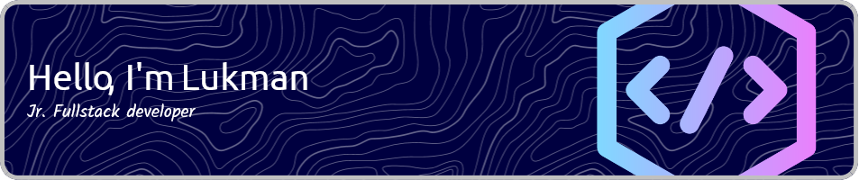

- 🔭 I’m currently working on [iquranic](https://github.com/Lukman350/iquranic)

- 🌱 I’m currently learning **Java, C#**

- 👨‍💻 All of my projects are available at [https://lukmann.dev](https://lukmann.dev)

- 💬 Ask me about **react, flutter, nextjs, pawn**

- 📫 How to reach me **lukmann.dev@gmail.com**

#### Connect with me:
 

#### Languages and Tools:

#### GitHub Stats:

